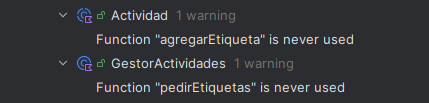

# Code Smell y Refactorización
- Para este ejercicio he seleccionado cinco code smells que me ha proporcionado el análisis de código del IDE.
- Se la ha hecho una prueba unitaria y refactorización al código.
- Las pruebas unitarias se harán en la clase 'codeSmellTest'.
## Errores encontrados
- El primer error fue solamente un constructor primario el cual estaba vacío, y por ello, inutilizado.
- Su único refactor necesario fue quitarle el constructor primario.

- El segundo y el tercer error fueron del mismo tipo, aunque distintos.
- Establecían que había funciones que no se utilizaban, por lo que sobraban y lo único que hacían eran estorbar y hacer más complejo el código.
- Fueron refactorizadas con 'Safe delete'.

- Al igual que el anterior, los dos siguientes establecen el mismo tipo de error, aunque en distintos sitios del programa.
- El error dice que ciertas funciones podrían ser privadas, lo cual no afectaría negativamente a código, al contrario.
- Indica que la visibilidad no está bien usada. Se corrigió refactorizando con Make 'x' 'private'.
- 