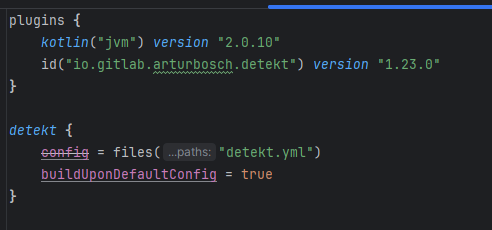
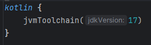

# Errores
Voy a arreglar estos cinco errores a continuación:

- C:\Users\juanm\IdeaProjects\taskmanager-debug-juanma\src\main\kotlin\modelo\Tarea.kt:6:7: Class 'Tarea' with '13' functions detected. Defined threshold inside classes is set to '11' [TooManyFunctions]
- C:\Users\juanm\IdeaProjects\taskmanager-debug-juanma\src\main\kotlin\servicios\GestorActividades.kt:21:9: The function menu appears to be too complex based on Cyclomatic Complexity (complexity: 16). Defined complexity threshold for methods is set to '15' [CyclomaticComplexMethod]
- C:\Users\juanm\IdeaProjects\taskmanager-debug-juanma\src\main\kotlin\servicios\GestorActividades.kt:14:7: Class 'GestorActividades' with '21' functions detected. Defined threshold inside classes is set to '11' [TooManyFunctions]
- C:\Users\juanm\IdeaProjects\taskmanager-debug-juanma\src\main\kotlin\servicios\GestorActividades.kt:111:18: The caught exception is swallowed. The original exception could be lost. [SwallowedException]
- C:\Users\juanm\IdeaProjects\taskmanager-debug-juanma\src\main\kotlin\datos\ActividadRepository.kt:1:1: The package declaration does not match the actual file location. [InvalidPackageDeclaration]

## Descarga Detekt
He importado el detekt, aunque he tenido que cambiar la versión jdk, ya que con las versiones más actuales no funcionaba.

## Soluciones
Solución del primer error ([TooManyFunctions]): https://github.com/juanma-ge/taskmanager-debug-juanma/commit/4cbb1482628713a5e1ea053d29caf50da8887615
- El error establecía que tenía demasiadas funciones en él, 13, y no pueden ser más de 11, así que he creado otra clase "historial" y he metido as funciones que tenían que ver con el historial.
Solución del segundo error ([CyclomaticComplexMethod]): https://github.com/juanma-ge/taskmanager-debug-juanma/commit/096ff322bdd17c61c4fdcee6d78294b53ebf5a64
- Este error decía que la clase GestorActividades tenía demasiadas funciones en su menú y era demasiado "complejo", así que lo he separado en dos, para reducir la cantidad de for, while, etc.
Solución del tercer error ([TooManyFunctions]): https://github.com/juanma-ge/taskmanager-debug-juanma/commit/6894f5a25dc64d372bda192436309534bf013f41
- Como en el primer error, este dice que hay demasiadas funciones en la clase, diex más concretamente, así que las he dividido en dos clases más.
Solución del cuarto error ([SwallowedException]): 