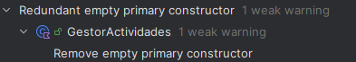
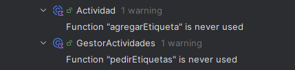
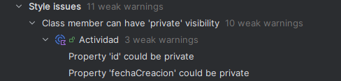

# Code Smell y Refactorización
- Para este ejercicio he seleccionado cinco code smells que me ha proporcionado el análisis de código del IDE.
- Se la ha hecho una prueba unitaria y refactorización al código.
- Las pruebas unitarias se harán en la clase 'codeSmellTest'.
## Errores encontrados
- El primer error fue solamente un constructor primario el cual estaba vacío, y por ello, inutilizado.
- Su único refactor necesario fue quitarle el constructor primario.

- El segundo y el tercer error fueron del mismo tipo, aunque distintos.
- Establecían que había funciones que no se utilizaban, por lo que sobraban y lo único que hacían eran estorbar y hacer más complejo el código.
- Fueron refactorizadas con 'Safe delete'.

- Al igual que el anterior, los dos siguientes establecen el mismo tipo de error, aunque en distintos sitios del programa.
- El error dice que ciertas funciones podrían ser privadas, lo cual no afectaría negativamente a código, al contrario.
- Indica que la visibilidad no está bien usada. Se corrigió refactorizando con 'Make 'x' 'private''.

## Preguntas a responder
- [1]
- 1.a ¿Qué code smell y patrones de refactorización has aplicado?
- He utilizado el analizador de código del IDE y he refactorizado tres tipos distintos de error.
- 'Remove empty primary constructor', 'Function is never used' y 'Could be private', a los cuales he aplicado; eliminación de constructor primario, 'Safe delete' y 'Make 'x' 'private'', respectivamente.
- 1.b Teniendo en cuenta aquella funcionalidad que tiene pruebas unitarias, selecciona un patrón de refactorización de los que has aplicado y que están cubierto por los test unitarios. ¿Porque mejora o no mejora tu código? Asegurate de poner enlaces a tu código
- El ejemplo a continuación, fue refactorizado con 'Safe delete', y su prueba unitaria hace que no haya ningún duplicado, es decir, que el código se mantenga limpio y sin tener funciones sin utilizar que estorben.
https://github.com/juanma-ge/taskmanager-debug-juanma/blob/b8b85554ab2bc219c431b5f1c82a24e7053f28f5/src/test/kotlin/services/codeSmellTest.kt#L25-L37
- [2]
- 2.a Describe el proceso que sigues para asegurarte que la refactorización no afecta a código que ya tenias desarrollado.
- Es tan fácil como utilizar el propio programa, es decir, probarlo para ver qu efuncione igual, o hacer debug, en caso de falle o algo ocurra distinto, ya sabrá por qué.
- [3]
- 3.a ¿Qué funcionalidad del IDE has usado para aplicar la refactorización seleccionada? Si es necesario, añade capturas de pantalla para identificar la funcionalidad.
- Depende del error quizás ni hace falta, pero generalmente al clicar en Refactor podrás corregir el error, ya sea un nombre o función sin utilizar.
- Aunque personalmente, he obtenido casos donde en el propio error, se puede corregir con la refactorización.

