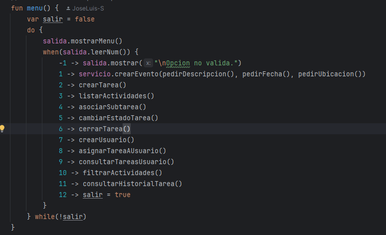
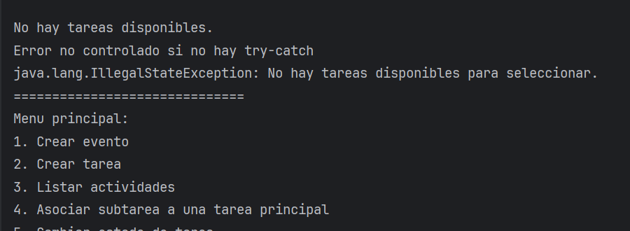
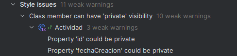
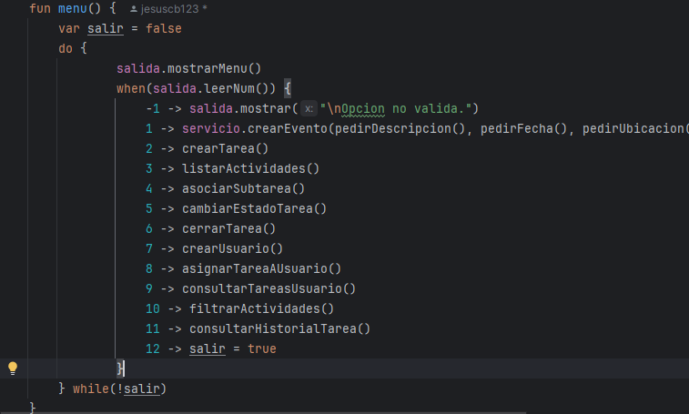
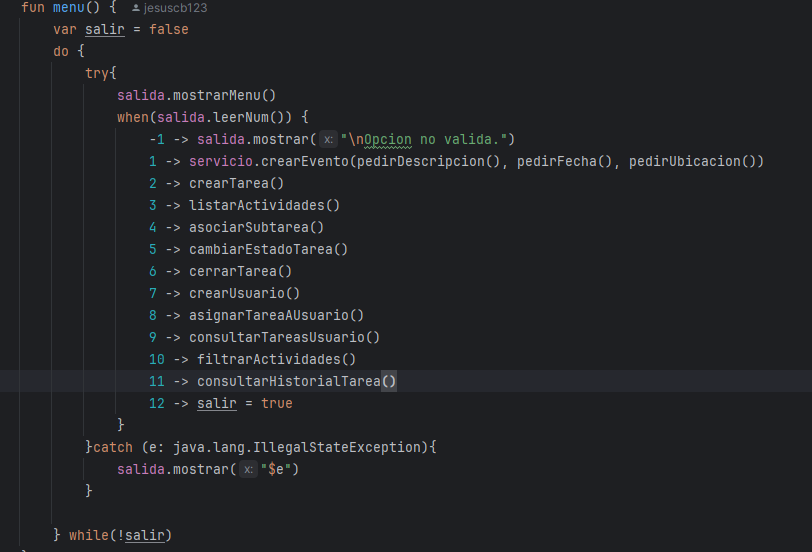

## TaskManager-Debug
Introducción

### Errores encontrados 
1. Error al seleccionar por consola la opción 6 del menú principal(Jesús)

He creado un punto de ruptura justo en el método menu qué es justo dónde salta el error. El problema era que el código lanza un error cuando no hay tareas existentes para cerrar
pero no lo captura, lo cuál hace que el programa se cierre de manera inminente. La solución ha sido introducir un try-catch en el método menu.
   https://github.com/jesuscb123/taskmanager-debug/blob/f33a9ffaa22aa372d290b3348deae7f88805037f/src/main/kotlin/servicios/GestorActividades.kt#L17-L42
Para encontrar el error, también podemos utilizar un println y ver por consola dónde está el error:

2. Error al seleccionar la opción 5 en el menú principal.

He puesto un punto de ruptura en el menú, aunque al final no fue del todo necesario, para ver si saltaba el error. El problema era que al no haber ninguna tarea daba error, haciendo que el programa se cierre.
Para solucionarlo he implementado un try and catch en el menu de la aplicación, para si vuelve a dar el error, que el programa no se cierre.

