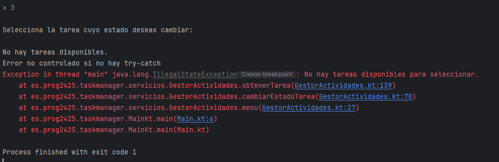
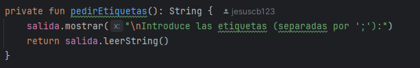
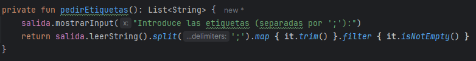
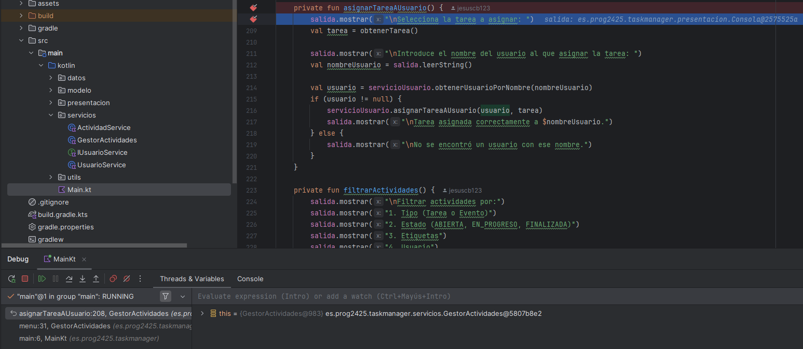
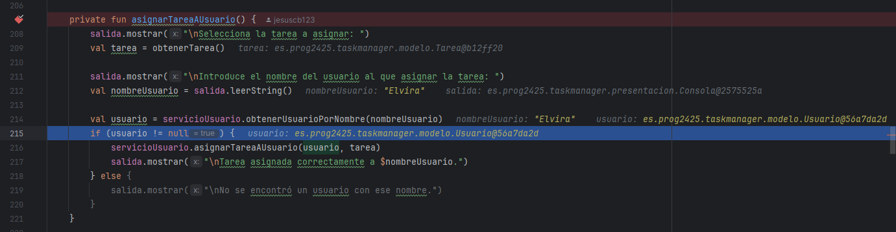
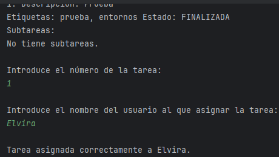
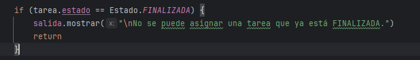
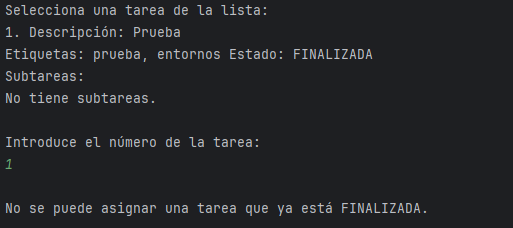
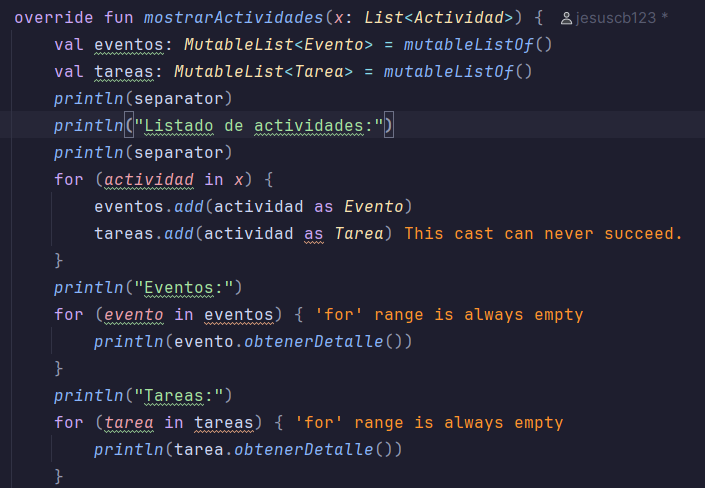
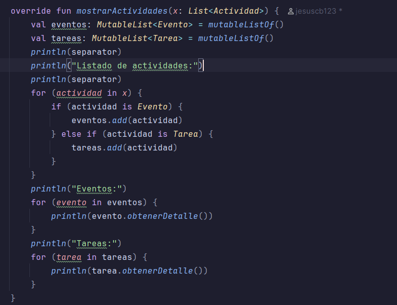

# TaskManager-Debug

## Introducción

## Errores encontrados 

### 1. Error al seleccionar por consola la opción 6 del menú principal(Jesús)


He creado un punto de ruptura justo en el método menu qué es justo dónde salta el error. El problema era que el código lanza un error cuando no hay tareas existentes para cerrar
pero no lo captura, lo cuál hace que el programa se cierre de manera inminente. La solución ha sido introducir un try-catch en el método menu.

Para encontrar el error, también podemos utilizar un println y ver por consola dónde está el error:


### 2. Error al seleccionar la opción 5 en el menú principal.




He puesto un punto de ruptura en el menú, aunque al final no fue del todo necesario, para ver si saltaba el error. El problema era que al no haber ninguna tarea daba error, haciendo que el programa se cierre.
Para solucionarlo he implementado un try and catch en el menu de la aplicación, para si vuelve a dar el error, que el programa no se cierre.


### 3. Error al separar las etiquetas (Jose Luis)

#### Imagen previa al error


Nos dimos cuenta de que, al pedir las etiquetas al usuario, todo lo que escribía (por ejemplo "urgente; oficina; reunión") 
llegaba al sistema como una sola frase en vez de como tres palabras separadas. Eso hacía que, al buscar tareas por una 
etiqueta concreta, nunca apareciera nada. Metimos un "punto de parada" para inspeccionar lo que se leía y comprobamos 
que seguía siendo un único texto. La solución fue muy simple: en lugar de pasar la cadena tal cual, la separamos donde 
hubiera ";", quitamos espacios sobrantes, de modo que el servicio recibiera siempre una 
lista limpia de etiquetas. Después de ajustar un par de pruebas para cubrir casos raros, todo empezó a funcionar bien.

#### Imagen posterior al error


### 4. Error al asignar una tarea ya finalizada (Elvira)

Probando el programa, nos percatamos de que era posible asignar una tarea ya finalizada a un usuario, lo que no tendría mucho sentido.
Para localizar exactamente dónde estaba el error, colocamos un punto de ruptura en la función de "asignarTarea()"



Aquí pudimos comprobar que asignaba la tarea directamente sin comprobar el estado de la tarea



En esta captura se observa como se puede asignar una tarea finalizada:



Para solucionar esto añadimos una comprobación en la que si el estado de la tarea es igual a finalizada, se saliera del programa retornando y mostrando un mensaje de error.



En esta captura se ve el error arreglado:



### 5. Error al intentar cerrar una tarea



Estaba trabajando en la clase Consola, concretamente en el método que muestro arriba, y encontré este error.

El método provocaba un cast forzado de todos los elementos de la lista a Evento y Tarea, sin comprobar el tipo.

Para solucionar el error, sustituimos el bloque de error por el siguiente para evitarlo

````kotlin
for (actividad in x) {
    if (actividad is Evento) {
        eventos.add(actividad)
    } else if (actividad is Tarea) {
        tareas.add(actividad)
    }
}
````



Quedando así el error arreglado y corregido.